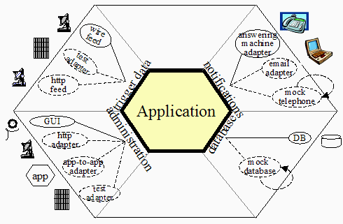

# hexagonal

## Summary
The project is organized like this:

```
app/
L model/
L storage/
  L sqlite3/
L ui/
  L http/
L admin/
  L http/
L lib/
L main.js
```

- There is a model folder, which contains the logic of the app, independent of implementation detail.
- For every connection between the app and the outside world, there is a port (interface).
- For each port, there is a folder for that port (`storage/`).
- For every adapter to a port (implementation of that interface), there is a subfolder for that adapter (`storage/sqlite3/`).
- There is a 'lib' folder for code that is implementation detail, but shared between adapters.
- main.js is the code that wires the rest together.
  It decides which modules are on/off (should decide based on environment?).

## Translating hexagonal architecture into code

### Background
The hexagonal (ports and adapters) pattern stipulates that modules in a system are to be connected through interfaces known as ports.
A module implementing such an interface is called an adapter for that port.



### Objects
This translates into modules represented as objects, connected through composition:

```
class Application {
  constructor(notifications_adapter, database_adapter) {
    this.notifications = notifications_adapter;
    this.database = database_adapter;
  }
}
```

In the example above, the trigger_data and administration ports are left ports (or driver ports).
So called because they are to the left of the image, they are not represented as the interfaces of objects passed into the application, but rather as the interface the application exposes to objects that receive it as a parameter.

```
class GUIAdministration {
  constructor(app) {
    this.app = app;
  }
}
```

The point of the separation is to allow the modules to be swapped out.

### Folders
This structure has some obvious implications on project structure:

```
/
L lib/
L application/
L notifications/
  L answering_machine/
  L email/
  L mock_telephone/
L database/
  L DB/
  L mock_database/
L trigger_data/
  L wire_feed/
  L http_feed/
L administration/
  L GUI/
  L http/
  L app_to_app/
L main.js
```

The interfaces in the system form natural categories to divide code into.
They are the places where the programmers have found they keep code mostly ignorant from the rest of the system, which means their _programmers_ can remain mostly ignorant from the rest of the system.

Every implementation of the same port shares the same interface<sup>[[1]](#1)</sup>.
They will be depended on by the same code.
They will respond in the same way to tests (assuming that no errors are present).
And given that the interfaces they consume and support are understood, they can be studied in isolation from the rest of the system.

There will be code that, while necessary, is shared between adapters and may even make sense separately from the rest of the project.
This is what the `lib/` folder is for.

EXPLAIN MAIN.JS

### When should you have a new port?
Cockburn's original article on the hexagonal architecture<sup>[[2]](#2)</sup>
gives a criterion for the creation of ports:

> As events arrive from the outside world at a port, a technology-specific adapter converts it into a usable procedure call or message and passes it to the application. The application is blissfully ignorant of the nature of the input device. When the application has something to send out, it sends it out through a port to an adapter, which creates the appropriate signals needed by the receiving technology (human or automated).

Whenever the application interacts with something real, it should do so through a port.
Partly so that it can be mocked during testing.
Partly so that different implementations can be accomodated.

# Notes

<sup><span id="1">1</span></sup>
...mostly.
Adapters share all methods that are part of the port contract, but are free to have more public methods, to have different dependencies, etc.
In brief: adapters must obey the Liskov substitution principle (they have to be _interchangeable_ from the perpective of their users) but that is all they need to be.

<sup><span id="2">2</span></sup>
Cockburn, Alistair. *Hexagonal Architecture.* 2005. https://alistair.cockburn.us/hexagonal-architecture/. Archive copy [at Archive.org](https://web.archive.org/web/20191210095000/https://alistair.cockburn.us/hexagonal-architecture/).